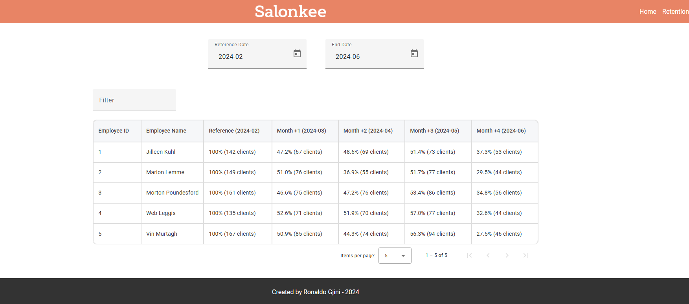

# Retention Data Task Presentation

This is the presentation for the retention data task by Ronaldo Gjini.

This project includes the backend and frontend components necessary for analyzing and visualizing retention data. The backend is built with Node.js and SQLite, while the frontend is developed using Angular.

## Getting Started

### Prerequisites

- Node.js
- npm (Node package manager)
- A database (SQLite)

### Architecture

The backend and frontend components of this project are decoupled. This means that they operate independently, allowing for greater flexibility and scalability. You will need to run both the backend and frontend servers individually.
